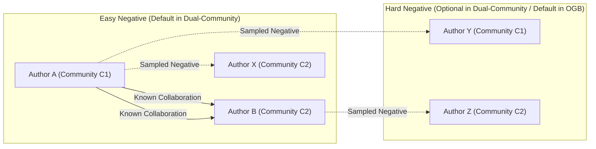

# Experiments and Empirical Benchmarking

This directory contains the experimental framework and benchmarking suites for the `pyalex` library. Our research focuses on the quantitative evaluation of scholarly metadata through graph-theoretical analysis and dense vector representations (embeddings).

## Research Objective

The primary objective is to evaluate the effectiveness of various **Embedding Aggregation Strategies** in representing complex scholarly entities (e.g., authors, institutions) for downstream predictive tasks. We specifically investigate the **Link Prediction** problem: predicting future scientific collaborations based on historical publication records.

---

## Methodology: Temporal Evaluation Framework

To ensure empirical rigour and avoid "data leakage", we employ a **temporal split validation** strategy:

1.  **Selection**: A research community is identified (e.g., "Quantum Computing" vs "Reinforcement Learning").
2.  **Temporal Cutoff ($T_{cutoff}$)**: Data is bifurcated at a specific year (default: 2016).
3.  **Representation Learning**: Author embeddings are synthesised from works published at $t \le T_{cutoff}$.
4.  **Ground Truth**: Positive collaboration labels are derived from joint publications appearing at $t > T_{cutoff}$.
5.  **Negative Sampling**: We generate negative pairs (authors who did not collaborate at $t > T_{cutoff}$) using various strategies. See the [Negative Sampling Strategies](#negative-sampling-strategies) section for details.

---

### Negative Sampling Strategies

We implement two main strategies for generating negative pairs (non-collaborating author pairs):

#### 1. Uniform Random Sampling (Default in Dual-Community Setups)
- For each positive pair (u, v) that collaborated after $T_{cutoff}$, we sample `k` negative pairs by randomly selecting authors from the entire set (or from the opposite community in dual-community setups) such that the sampled pair (u, v') or (u', v) did not collaborate after $T_{cutoff}$.
- **Example**: If we have a positive pair (Author A from Quantum Computing, Author B from Reinforcement Learning), we might sample negative pairs (Author A, Author X) and (Author Y, Author B) where Author X is randomly chosen from Reinforcement Learning and Author Y from Quantum Computing, and neither (A, X) nor (Y, B) collaborated after $T_{cutoff}$.
- This strategy tends to produce "easy" negatives because the negative pairs are often from different communities, making them semantically dissimilar to the positive pair.

#### 2. Hard Negative Sampling (In-Distribution, Default in OGB-Style Single-Community Setups)
- Used in single-disciplinary (OGB-style) setups. Here, we sample negative pairs from within the same community or topical cluster, making the task harder because the negative pairs are semantically similar to the positive ones.
- **Example**: In a computer science network, instead of sampling a negative pair from different fields (e.g., a quantum physicist and a reinforcement learning researcher), we sample two authors from the same subfield (e.g., two machine learning researchers) who have not collaborated after $T_{cutoff}$.
- This strategy produces "hard" negatives that require the model to discern subtle specialisation differences.

The following diagram illustrates the difference between easy and hard negative sampling in a dual-community setup:



**Note**: In the diagram:
- Solid lines indicate known collaborations (positive pairs) after $T_{cutoff}$.
- Dashed lines indicate sampled negative pairs (no collaboration after $T_{cutoff}$).
- Community C1 and C2 represent two distinct research communities (e.g., Quantum Computing and Reinforcement Learning).

---

## Dataset Construction: Selection and Balancing

A critical component of this benchmarking suite is the curation of dual-community datasets. The validity of our link prediction results depends on the controlled variance between two target populations ($C_1, C_2$).

### Selection Approaches

We employ three distinct approaches for seeding these communities:

1.  **Topical Disjunction (Semantic Baseline)**: Selecting fields with minimal semantic overlap (e.g., *Quantum Computing* and *Reinforcement Learning*). This provides a "gold standard" for testing the basic discriminatory power of embedding-based metrics.
2.  **Structural (Institutional) Seeding**: Selecting communities based on institutional boundaries (e.g., *MIT CSAIL* vs *University of Cambridge*). This approach captures real-world socio-academic boundaries where collaboration is more likely to be driven by location and prestige than purely by semantic similarity.
3.  **Cross-Disciplinary Convergence**: Selecting fields with high potential for interdisciplinary fertilisation (e.g., *Computational Biology* and *Natural Language Processing*). This serves as a "stress test" for prediction models, as the semantic boundary is porous and evolving.

### Balancing Factors

To ensure statistical comparability, we evaluate and balance the following factors across the two communities:

-   **Author Productivity Distributions**: We align the two communities to ensure that the distribution of "works per author" is comparable, preventing the model from over-relying on "super-connectors" in one group.
-   **Temporal Publication Flux**: Both communities must exhibit similar growth patterns over time, particularly across the $T_{cutoff}$ boundary, to ensure the temporal split does not introduce an artificial bias.
-   **Graph Edge Density**: We normalise for the intrinsic "collaboration rates" of different disciplines. For instance, Experimental Physics often has higher average co-author counts than Theoretical Mathematics.
-   **Metadata Richness**: We ensure consistency in the availability and length of abstracts across both groups, as varied semantic density can disproportionately favour one community in NLP-based embedding tasks.

### Empirical Diagnostics for Dataset Balancing

To verify that a curated dataset adheres to these balancing criteria, we employ the following empirical diagnostics:

1.  **Productivity Distribution Match**:
    -   *Method*: We calculate the empirical cumulative distribution function (ECDF) of the number of publications per author for each community.
    -   *Metric*: The **Kolmogorov-Smirnov (K-S) statistic** is used to quantify the distance between the two distributions. A low K-S value ($D < 0.1$) indicates that the communities are structurally similar in terms of author productivity.

2.  **Temporal Flux Alignment**:
    -   *Method*: We treat the annual publication count as a time-series signal.
    -   *Metric*: We compute the **Jensen-Shannon (JS) Divergence** between the normalised temporal distributions. Low divergence confirms that both communities were active and evolving at similar rates leading up to $T_{cutoff}$.

3.  **Topological Connectivity**:
    -   *Method*: Analysis of the co-authorship subgraphs for each community.
    -   *Metric*: We compare the **Global Clustering Coefficient** and **Density**. Significant disparities in these values would suggest that one community is intrinsically more "cliquish" or collaborative, which can confound link prediction results.

4.  **Semantic Information Density**:
    -   *Method*: Statistical summary of the token counts for titles and abstracts.
    -   *Metric*: **Information Entropy** or simple distribution of character lengths. Large variances in metadata richness across communities can lead to "semantic bias", where the embedding model performs better on the more descriptive group.

---

## Extension: Single-Disciplinary Benchmarking (OGB-Style)

While the current pipeline emphasises inter-disciplinary "bridge" prediction, it can be extended to **intra-disciplinary benchmarking**, aligning with standards such as the *Open Graph Benchmark (OGB) `ogbl-collab`* dataset. 

In this configuration, the objective shifts from discriminating between two communities ($C_1$ vs $C_2$) to predicting the evolution of a **homogeneous research network**.

### Methodological Adaptations

To transition from a dual-community to a single-disciplinary setup, the following adaptations are required:

1.  **Homogeneous Seeding**: 
    -   Instead of multiple entry points, the pipeline seeds from a singular, high-level discipline (e.g., *Computer Science* or *Physiology*) or a specific sub-field.
    -   *Extension Strategy*: Utilise deep-recursive expansion (`expand --mode author_work --limit 2000`) to capture the full "core-periphery" structure of the field, ensuring the graph contains both established clusters and emerging nodes.

2.  **Hard Negative Sampling**:
    -   In dual-community datasets, negative pairs are often "easy" (i.e., sampling one author from $C_1$ and another from $C_2$).
    -   In a single-disciplinary OGB-style setup, we must implement **In-Distribution Negative Sampling**. This involves sampling pairs from the same semantic cluster who have no observed collaboration at $t > T_{cutoff}$. This increases the "hardness" of the task, requiring the embedding model to capture subtle sub-specialisation differences rather than coarse domain gaps.

3.  **Temporal Edge Prediction**:
    -   Unlike the binary "collaboration or not" task in dual-community setups, a single-disciplinary experiment can focus on **Edge Addition Prediction**. 
    -   The metric suite should be extended to include **Hits@K**, which measures if a true future collaborator appears in the top $K$ predicted neighbours within the same disciplinary graph.

### Comparison of Dataset Paradigms

| Feature | Inter-Disciplinary (Dual) | Intra-Disciplinary (Single/OGB) |
| :--- | :--- | :--- |
| **Seeding** | Two disjoint or overlapping sets. | A single large-scale disciplinary set. |
| **Negative Sampling** | Cross-community pairs (Easy/Medium). | High-similarity intra-community pairs (Hard). |
| **Primary Goal** | Measuring "boundary-crossing" signal. | Measuring "specialisation-matching" signal. |
| **Balanced Factor** | Group-level parity (Productivity, Year). | Internal density and connectivity decay. |

---

## Embedding Aggregation Strategies

Given a set of work embeddings $\mathcal{E} = \{e_1, e_2, \dots, e_n\}$ for an author, we implement several strategies to derive a singular author-level representation $z_{author} \in \mathbb{R}^d$:

| Strategy | Mathematical Intuition | Rationale |
| :--- | :--- | :--- |
| **Simple Mean** | $\frac{1}{n} \sum e_i$ | Assumes all works contribute equally to the author's research profile. |
| **Recency Weighted** | $\sum w_i e_i$ | Weights $w_i \propto \frac{1}{T_{cutoff} - T_i + 1}$. Prioritises recent research interests over historical ones. |
| **Citation Weighted** | $\sum \frac{\log(1+c_i)}{\sum \log(1+c_j)} e_i$ | Weights $e_i$ by the log-scaled citation count $c_i$. Emphasises highly impactful/influential works. |
| **Max Pooling** | $[\max(e_{i1}), \dots, \max(e_{id})]$ | Captures the "strongest" semantic signals across the author's career dimensions. |
| **Joint Embedding** | $Embed(Concat(Abstracts))$ | Concatenates all historical titles and abstracts into a single document before embedding. Captures inter-document semantic coherence. |

---

## Evaluation Metrics

We quantify prediction performance using four complementary statistical metrics. Let $S(u, v) = \cos(z_u, z_v)$ be the similarity between two authors.

### 1. Area Under the ROC Curve (AUC-ROC)
The primary metric for binary classification. It represents the probability that a randomly chosen positive pair is ranked higher than a randomly chosen negative pair.
*   **Significance**: Measures the model's ability to discriminate between classes regardless of the classification threshold ($0.5 \le AUC \le 1.0$).

### 2. Average Precision (AP)
Calculated as the area under the Precision-Recall curve: $AP = \sum_n (R_n - R_{n-1}) P_n$.
*   **Significance**: Highly sensitive to the ranking of positive samples. In our imbalanced dataset (10:1 negatives), AP provides a more realistic assessment of performance than accuracy.

### 3. Precision at K (P@K)
The proportion of correctly predicted collaborations within the top $K$ most similar pairs, where $K$ equals the total number of actual future collaborations.
*   **Significance**: Simulates a recommender system scenario (e.g., "Who should this researcher collaborate with next?").

### 4. Spearman's Rank Correlation ($\rho$)
A non-parametric measure of rank correlation between the predicted similarity scores $S(u, v)$ and the binary labels $\{0, 1\}$.
*   **Significance**: Evaluates whether increasing similarity strictly corresponds to a higher likelihood of collaboration, without assuming a linear relationship.

---

## Analysis of Semantic Trajectories

Beyond prediction, we provide tools for **longitudinal trajectory analysis** (`semantic_trajectory.py`). 

-   **Projection**: Author embeddings are computed annually.
-   **Ternary Mapping**: These embeddings are projected into a 2D simplex (ternary plot) defined by three "anchor" topics (e.g., Physics, Computer Science, Biology).
-   **Softmax Normalisation**: We apply a softmax function with temperature $\tau$ to the cosine similarities between author and topic embeddings to derive distinct probability coordinates.

---

## Directory Structure

```text
experiments/
├── datasets/            # Benchmarking data (Quantum vs RL, MIT vs Cambridge)
├── aggregations.py      # Mathematical implementation of feature synthesis
├── metrics.py           # Statistical evaluation implementation
├── graph_utils.py       # Graph processing and metadata extraction
├── evaluator.py         # Link prediction and semantic consistency logic
├── collaboration_prediction.py  # CLI for prediction pipeline
├── visualisation.py     # Visualization tools for calibration and error analysis
└── semantic_trajectory.py       # CLI for longitudinal analysis
```

---

## Usage

To execute the standardised collaboration prediction pipeline:

```bash
# 1. Prepare data and generate embeddings
uv run python experiments/collaboration_prediction.py prepare \
    path/to/graph.graphml -o prepared.json --cutoff-year 2018

# 2. Evaluate strategies
uv run python experiments/collaboration_prediction.py evaluate prepared.json
```

To generate calibration plots and error stratification analysis after evaluation:

```bash
# 3. Generate calibration plots (requires saved predictions)
uv run python experiments/visualisation.py --plot-calibration \
    --true-labels true_labels.npy --pred-probs pred_probs.npy \
    --output-dir ./calibration_plots

# 4. Generate error stratification plots
uv run python experiments/visualisation.py --plot-error-stratification \
    --error-rates error_rates.json --x-labels "Low Prod,Medium Prod,High Prod" \
    --output-dir ./stratification_plots
```